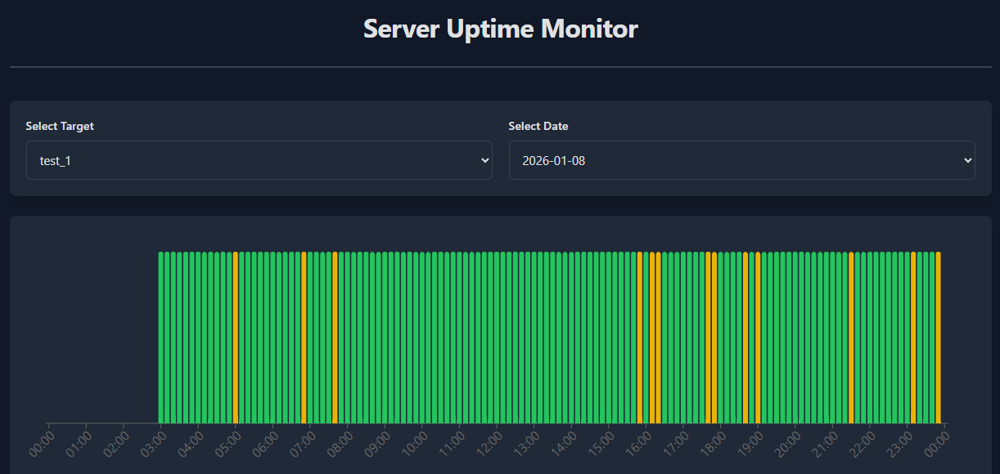

# Server Uptime Monitor

> **Note**: This project was built entirely using the [Cursor](https://cursor.com) AI agent, made to test the AI development process on a simple project.  

A simple tool to monitor server uptime by pinging target IP addresses and visualizing the results in a web dashboard. Designed to run via cron jobs for automated monitoring.



## Technologies Used

- **Frontend**: React with TypeScript
- **Build Tool**: Vite
- **Charts**: Recharts
- **Monitoring Script**: Bash (Windows-compatible via Git Bash)
- **Deployment**: GitHub Pages with GitHub Actions

## Usage Guide

### Setting Up the Monitor

1. **Clone the repository**:
   ```bash
   git clone https://github.com/luqas11/uptime-monitor.git
   cd uptime-monitor
   ```

2. **Set up cron jobs** for automated monitoring. The project requires three cron jobs to run automatically:

   **a. Ping Monitor** (run every minute):
   ```bash
   * * * * * /path/to/uptime-monitor/scripts/ping_monitor.sh <TARGET_NAME> <IP_ADDRESS>
   ```
   Example:
   ```bash
   * * * * * /home/user/uptime-monitor/scripts/ping_monitor.sh server1 192.168.1.1
   ```
   This will ping the specified IP address once per minute and log the result to daily CSV files.

   **b. Data Sync** (run hourly):
   ```bash
   0 * * * * /path/to/uptime-monitor/scripts/sync-data.sh
   ```
   This script pulls latest changes, adds data files, commits and pushes to the repository.

   **c. Data Cleanup** (run daily):
   ```bash
   0 2 * * * /path/to/uptime-monitor/scripts/cleanup-old-data.sh
   ```
   This script deletes CSV files older than 90 days based on filename date.

   **Important**: 
   - Use absolute paths in your crontab
   - Ensure scripts are executable: `chmod +x scripts/*.sh`
   - Edit your crontab with: `crontab -e`

3. **Target naming rules**: The target name can only contain letters, numbers and underscores.

4. **Multiple monitors**: Set up separate cron jobs for each target you want to monitor:
   ```bash
   * * * * * /path/to/uptime-monitor/scripts/ping_monitor.sh server1 192.168.1.1
   * * * * * /path/to/uptime-monitor/scripts/ping_monitor.sh google_dns 8.8.8.8
   ```
   Each target will have its own folder with separate daily files.

5. **Testing and Development**: For testing purposes or when cron jobs are not available, you can use loop mode:
   ```bash
   bash scripts/ping_monitor.sh server1 192.168.1.1 loop
   ```
   This will continuously ping every 60 seconds until stopped with `Ctrl+C`. Note that loop mode is intended for testing and development only; production use should rely on cron jobs.

### Viewing the Dashboard

1. **Install dependencies**:
   ```bash
   npm install
   ```

2. **Start the development server**:
   ```bash
   npm run dev
   ```

3. **Open your browser** and navigate to the local development URL (usually `http://localhost:5173`)

4. **View the data**: The dashboard will automatically load and display the ping results from the GitHub repository

### Using the Dashboard

- **Target Selection**: Use the first dropdown to select which target to visualize (e.g., `server1`, `google_dns`)
- **Date Selection**: Use the second dropdown to select which day's data to view (dates are automatically detected from available files in the GitHub repository)
- **Chart Display**: The chart displays the full 24-hour period for the selected date
- **Bar Chart**: 
  - Green bars indicate periods where all pings were successful (server was online)
  - Red bars indicate periods where all pings failed (server was offline)
  - Yellow bars indicate periods with mixed results (unstable - both successful and failed pings)
  - Gray bars show periods with no data

## Data Format

All CSV files follow the same format with two columns:
- `timestamp`: UNIX timestamp (seconds since epoch)
- `success`: `true` if ping was successful, `false` if it failed

**Example**:
```csv
timestamp,success
1703123456,true
1703123516,false
1703123576,true
```

**Data Organization**:
- Each target (monitored IP) has its own folder in `data/`
- Daily files are automatically created with the format `YYYY-MM-DD.csv`
- Example structure:
  ```
  data/
  ├── server1/
  │   ├── 2026-01-08.csv
  │   └── 2026-01-09.csv
  └── google_dns/
      ├── 2026-01-09.csv
      └── 2026-01-10.csv
  ```

The dashboard fetches data directly from the GitHub repository using raw content URLs. All targets and dates are automatically detected from the manifest file.

## Deployment

The application is automatically deployed to GitHub Pages whenever changes are pushed to the `main` branch. The live version is available at:

**https://luqas11.github.io/uptime-monitor/**
